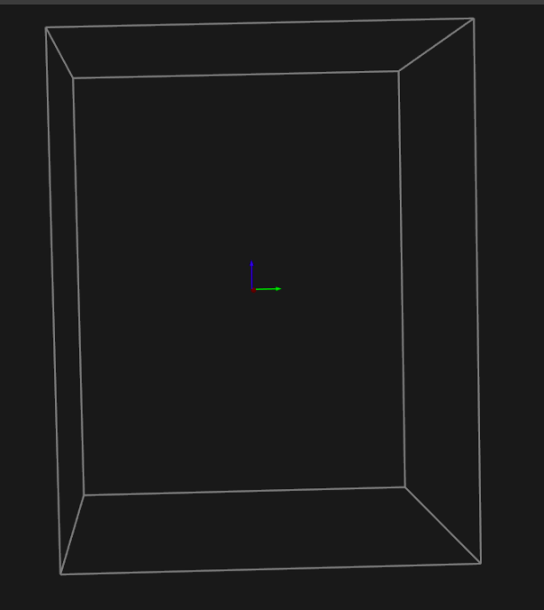
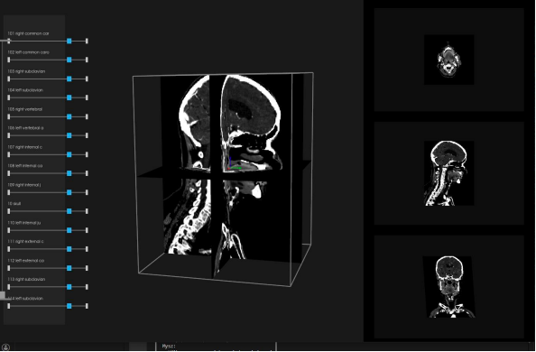
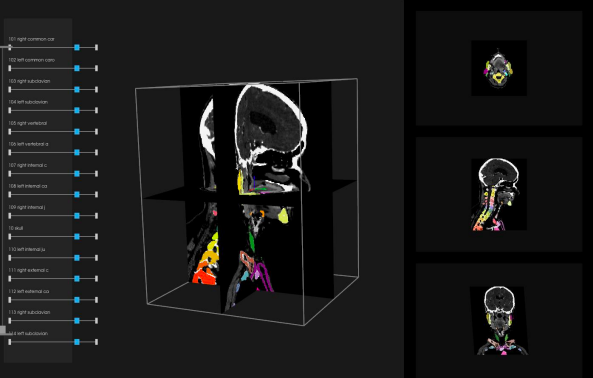
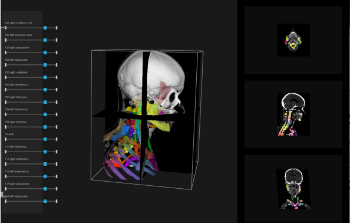
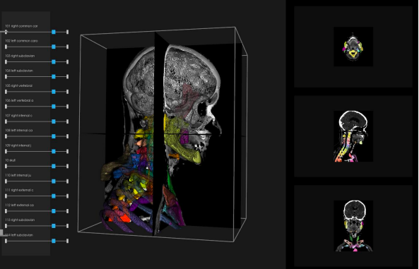
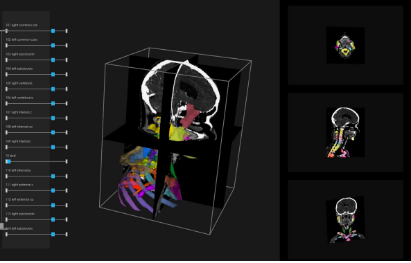
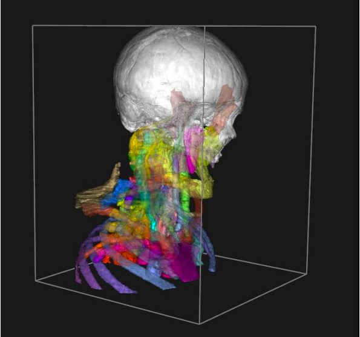

# 3D Anatomical Atlas Visualization

An interactive 3D visualization tool for the SPL/NAC Head and Neck Atlas, built with Python and VTK. The application renders 59 anatomical structures with real-time orthogonal cross-sections, color segmentation, transparency control, and procedurally generated smoothed surfaces.

---

## Demo















---

## What is This?

Medical 3D visualization is a standard tool in diagnostics and surgical planning — especially for the head and neck region, where the spatial relationships between structures are complex. This application allows students and clinicians to interactively explore volumetric data in three orthogonal planes, overlay color segmentation on grayscale images, and control the transparency of individual anatomical structures.

The dataset used is the **SPL/NAC Head and Neck Atlas** from Harvard Medical School, containing 62 precisely segmented structures in NRRD format along with prebuilt 3D VTK models.

---

## Features

- 3D rendering of **59 anatomical structures** of the head and neck
- **Three orthogonal cross-sections** (axial, sagittal, coronal) with real-time position control
- **Color segmentation** overlaid on grayscale images, synchronized with 3D models
- **Per-structure transparency control** via a scrollable slider panel
- **Smoothed model generation** on demand using a Discrete Marching Cubes → Windowed Sinc → Decimation pipeline
- Multiple display modes: surface, wireframe, outline
- Mouse and keyboard controls

---

## Algorithm: Smoothed Model Generation

When the user presses `c`, the application procedurally generates smoothed 3D surfaces directly from volumetric segmentation data using a three-stage VTK pipeline:

**Stage 1 — Surface extraction (Discrete Marching Cubes):** Analyzes the volumetric label data and generates a triangle mesh along boundaries between anatomical regions. Works by interpolating values in 3D space and creating isosurfaces for each structure's label ID.

**Stage 2 — Smoothing (Windowed Sinc filter):** Applies 20 iterations of sinc-kernel convolution to eliminate the staircase artifacts typical of voxel data, while preserving sharp anatomical edges (FeatureAngle = 120°).

**Stage 3 — Decimation:** Reduces the polygon count by 60% while preserving topology, optimizing rendering performance without losing significant anatomical detail.

This allows direct comparison between the prebuilt VTK models and procedurally generated surfaces from the same underlying data.

---

## Requirements

- Python 3.7+ (tested on 3.11.9)
- VTK 9.x (tested on 9.5.2)
- Windows / Linux / macOS

---

## Installation

### 1. Clone the repository

```bash
git clone https://github.com/YOUR_USERNAME/YOUR_REPO.git
cd YOUR_REPO
```

### 2. Install dependencies

```bash
pip install -r requirements.txt
```

### 3. Download the atlas data

Download the **SPL/NAC Head and Neck Atlas (2016-09)** from:
- https://www.openanatomy.org/atlases/nac/head-neck-2016-09.zip

Extract the archive into the `App/` directory so that `head-neck-2016-09/` is placed directly inside `App/`.

### 4. Run the application

```bash
cd App
python main.py
```

---

## Controls

### Mouse

| Action | Result |
|--------|--------|
| Left button + drag | Rotate 3D view |
| Right button + drag | Zoom in/out |
| Middle button + drag | Pan |
| Scroll wheel | Zoom |

### Keyboard

| Key | Action |
|-----|--------|
| `h` | Show help |
| `r` | Reset camera |
| `w` | Wireframe mode |
| `s` | Surface mode |
| `o` | Toggle outline (bounding box) |
| `g` | Toggle segmentation overlay |
| `c` | Toggle smoothed models (generated on first press) |
| `t` | Toggle 3D models on/off |
| `↑` / `↓` | Move axial cross-section |
| `←` / `→` | Move coronal cross-section |
| `PgUp` / `PgDn` | Move sagittal cross-section |
| `q` or `Esc` | Quit |

### UI Panels

- **Left panel** — scrollable transparency sliders for all 59 anatomical structures (range 0.0–1.0, default 0.8)
- **Right panel** — three orthogonal cross-section previews with position sliders

---

## Project Structure

```
.
├── App/
│   └── main.py          # Main application
├── screenshots/          # Demo screenshots
├── requirements.txt
└── README.md
```

> **Note:** The atlas data (`head-neck-2016-09/`) is not included in this repository. See the Installation section for download instructions.

---

## Dataset

**SPL/NAC Head and Neck Atlas (2016-09)**
- Source: [OpenAnatomy](https://www.openanatomy.org/atlas-pages/atlas-spl-head-and-neck.html)
- Origin: Harvard Medical School / Surgical Planning Laboratory
- Format: NRRD (volumetric data), VTK (3D models), CTBL (color tables)
- License: See OpenAnatomy website for terms of use

---

## Technology

- **[VTK](https://vtk.org/)** — 3D rendering, medical image processing, geometry pipeline
- **NRRD** — Nearly Raw Raster Data format for volumetric medical images
- **Algorithms**: Discrete Marching Cubes, Windowed Sinc smoothing, Decimation (vtkDecimatePro)

---

## License

MIT
